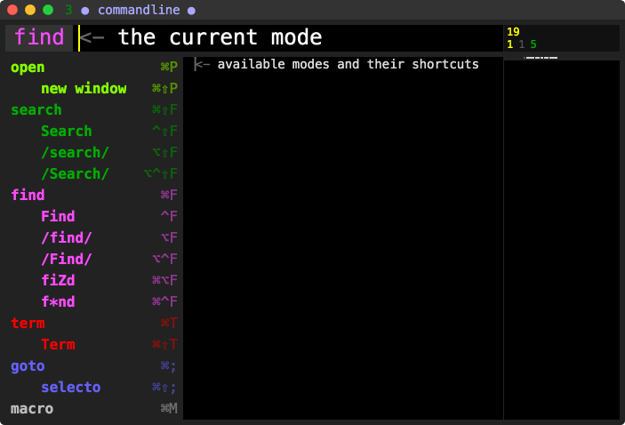
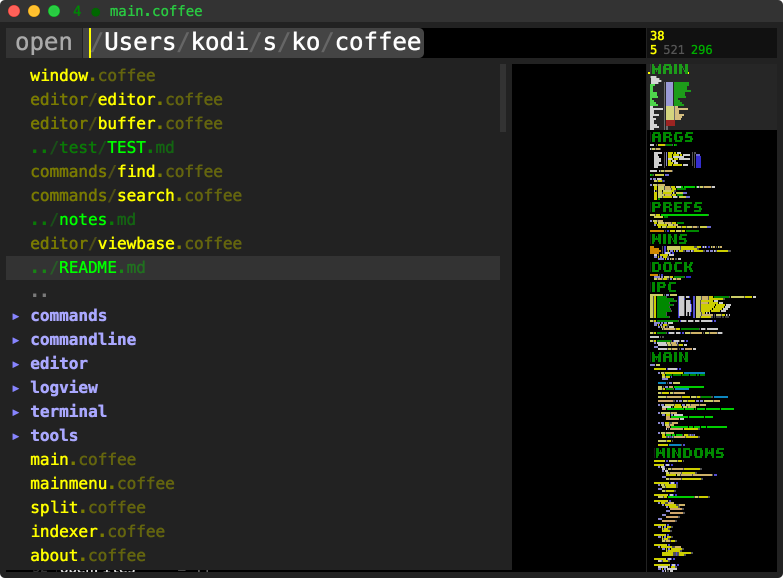
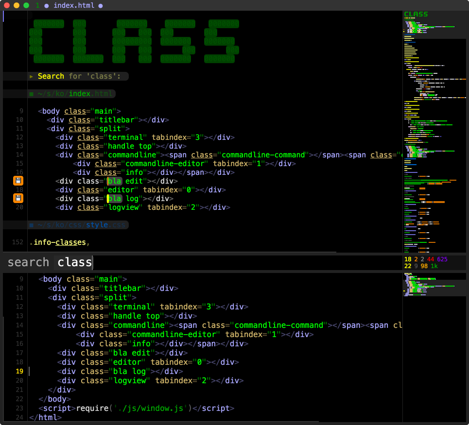
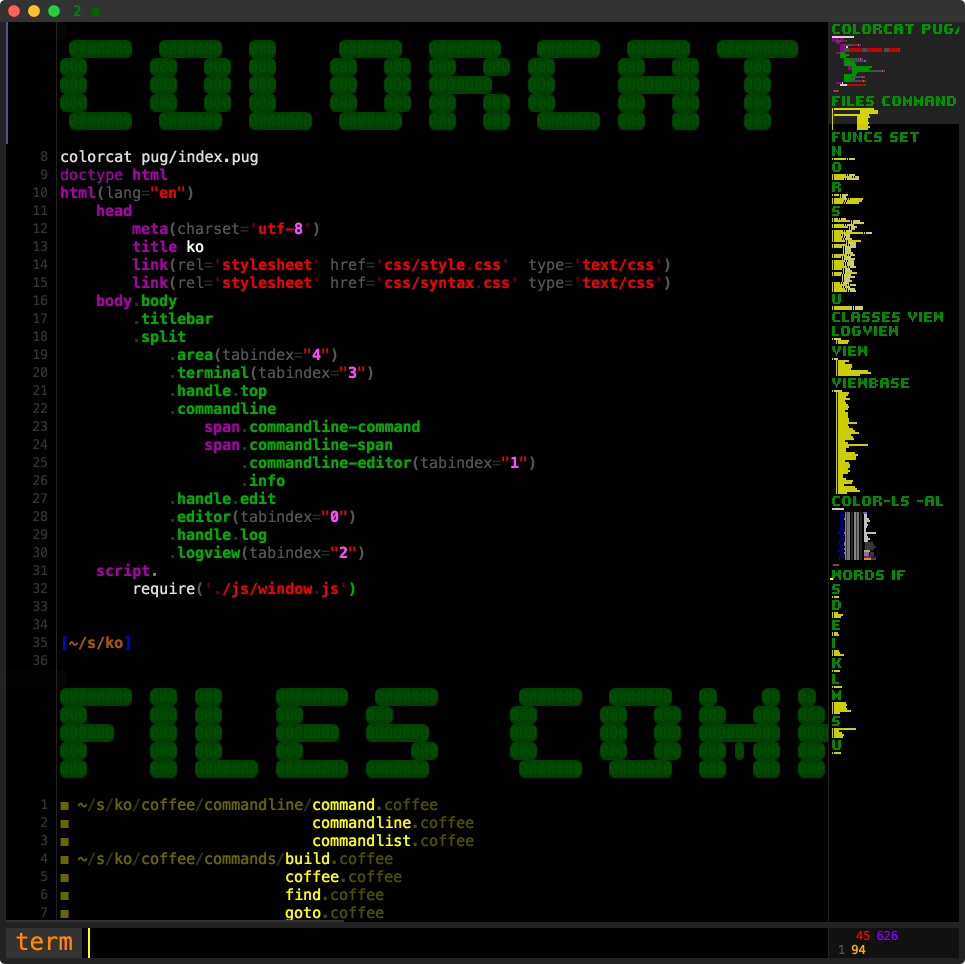
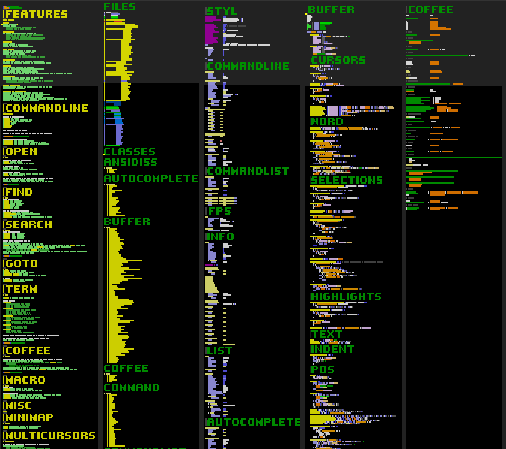
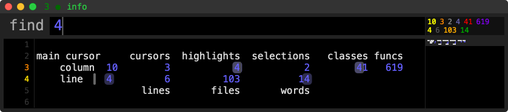

<!---
#   00000000  00000000   0000000   000000000  000   000  00000000   00000000   0000000
#   000       000       000   000     000     000   000  000   000  000       000     
#   000000    0000000   000000000     000     000   000  0000000    0000000   0000000 
#   000       000       000   000     000     000   000  000   000  000            000
#   000       00000000  000   000     000      0000000   000   000  00000000  0000000 
--->
# main features

**fast**
- loads large files
- keyboard centric 
    - nothing you can do with the mouse only
    - includes lots of fancy shortcuts

**commandline**
- a single, non-intrusive input field to ...
    - navigate the file system and open files quickly
    - find in text and search in files
    - input terminal-, coffee-script- and macro-commands
    - goto lines or class/method/function-definitions

**terminal**
- alias, history
- echos commands as ascii-headers
- output of commands editable/searchable

**file search**
- search for strings/regexp in project files
- automatic determination of project files
- search results are editable
    - edits can be saved back to files
    - more powerful than conventional search and replace

**multicursors**
- a little less chaotic than some other implementations
- powerful set of keyboard shortcuts for modification of cursors

**minimap**
- shows cursors, highlights and selections
- also for terminal-, search- and coffe-script-results!
- can be used to select large portions of text
- sets cursor by default when dragging/clicking
- includes a special mode to insert or edit ascii-headers that show up nicely in the minimap

**autocomplete**
- completes words from visited files and project files
- automatic determination of project files:
    - indexes files below directory containing .git or package.json
    - ignores node_modules, .git, etc.

**syntax highlighting**
- for coffee, cpp, h, html, js, json, md, noon, pug, py, sh, styl       
- ansi-colors in terminal view

**optimized for coffee-script**
- completes function/method names from required files
- terminal commands to list classes, files or functions/methods
- autoconverts 'simple' strings when "#{}" is inserted
- removes 'then' when breaking single-line 'when' or 'if' statements  
- deletes whitespace after function names when surrounding selected arguments with ()
- includes a some nifty macros for coffee-script

<!---
#    0000000   0000000   00     00  00     00   0000000   000   000  0000000    000      000  000   000  00000000
#   000       000   000  000   000  000   000  000   000  0000  000  000   000  000      000  0000  000  000     
#   000       000   000  000000000  000000000  000000000  000 0 000  000   000  000      000  000 0 000  0000000 
#   000       000   000  000 0 000  000 0 000  000   000  000  0000  000   000  000      000  000  0000  000     
#    0000000   0000000   000   000  000   000  000   000  000   000  0000000    0000000  000  000   000  00000000
--->
# commandline

operates in different modes:
- **open** new window
- **find** Find /find/ /Find/ fiZd f*nd
- **search** Search /search/ /Search/
- **goto** selecto
- **term** Term
- **coffee**
- **macro**

each mode keeps it's own history

clicking on the command name lists all modes and their shortcuts:
    

while the commandline has focus:
- **^up|down** move command input up|down
- **⌘up|down** move command input to top|bottom of window
- **⌥up|down** move command input a quarter of window up|down

<!---
#    0000000   00000000   00000000  000   000
#   000   000  000   000  000       0000  000
#   000   000  00000000   0000000   000 0 000
#   000   000  000        000       000  0000
#    0000000   000        00000000  000   000
--->
## open

opens files quickly via fuzzy matching
- **⌘P** open file quickly
- **⌘⇧P** open file quickly in new window

on activation, it ...
- lists recent files on top 
- the most recent file is selected by default
    
while the list is open:
- **.** list current directory without previous files
- **..** navigate directory up

the list content depends on the file currently opened in the editor
- files in surrounding project directories are included
- switching projects is simple: just open a file in the new project

<!---
#   00000000  000  000   000  0000000  
#   000       000  0000  000  000   000
#   000000    000  000 0 000  000   000
#   000       000  000  0000  000   000
#   000       000  000   000  0000000  
--->
## find
search in current file
- **⌘F**  case insensitive
- **^F**  case sensitive
- **⌥F**  regexp insensitive
- **^⌥F** regexp sensitive
- **⌘⌥F** fuzzy search
- **⌘^F** glob search
     
when the find commandline has focus
- **enter** select next highlighted word
- **shift+enter** select previous highlighted word
- **tab** set focus on editor
- **⌘enter** select next highlighted word and set focus on editor

<!---
#    0000000  00000000   0000000   00000000    0000000  000   000
#   000       000       000   000  000   000  000       000   000
#   0000000   0000000   000000000  0000000    000       000000000
#        000  000       000   000  000   000  000       000   000
#   0000000   00000000  000   000  000   000   0000000  000   000
--->
## search
search in project files
- **⌘⇧F**   case   insensitive
- **^⇧F**   case   sensitive
- **⌥⇧F**   regexp insensitive
- **^⌥⇧F**  regexp sensitive
    
editing search result lines will ...
- mark them for saving
- changes are propagated immediately to all open files
- **⌘S** (while the search-results view has focus) will save all pending changes in open **and** closed files
- deleting lines from the search results will **not** remove them from their original files
- changes from the editor are not yet propagated to old search results
    - this means: only edit and save **fresh** search results!
- this is a very powerful feature but not tested thoroughly yet and probably not working correctly in all cases!
- use at your own risk! backup your files! 

<!---
#    0000000    0000000   000000000   0000000 
#   000        000   000     000     000   000
#   000  0000  000   000     000     000   000
#   000   000  000   000     000     000   000
#    0000000    0000000      000      0000000 
--->
## goto
- **⌘;** activates goto command
- **text** jump to function, class or file
- **positive number** jump to line
- **negative number** jump to line relative to end of file

in editor:
- **⌥enter** goto word under main cursor
- **⌥click** goto clicked word

<!---
#   000000000  00000000  00000000   00     00
#      000     000       000   000  000   000
#      000     0000000   0000000    000000000
#      000     000       000   000  000 0 000
#      000     00000000  000   000  000   000
--->
## term

- **⌘T** to activate pseudo terminal input

special commands
- **alias**
    - without argument: list aliases
    - with one argument: clear alias
    - with two arguments: set alias
- **history**
    - without argument: list command history
    - !! to repeat last command
    - !n to repeat command with id n
    - !~n to remove command with id n
- **classes**
    - list coffee-script classes and their methods
    - click on result jumps to definition
- **funcs**
    - list coffee-script functions and methods
    - click on result jumps to definition
- **files**
    - list indexed project files
    - click on result opens file
- **words**
    - list indexed words
    - click on word starts search command

classes, funcs, files and words results can be filtered by adding arguments

all other commands are passed to a child process running bash
- only works for commands that terminate!

<!---
#    0000000   0000000   00000000  00000000  00000000  00000000
#   000       000   000  000       000       000       000     
#   000       000   000  000000    000000    0000000   0000000 
#   000       000   000  000       000       000       000     
#    0000000   0000000   000       000       00000000  00000000
--->
## coffee

evaluates coffee-script code in the main process and prints results in terminal
- since the code is evaluated in the main process ...
    - indexer internals and windows are accessible (via global **main** object)
    - results are 
        - persistent for the lifetime of the app
        - shared between windows
- the commandline input is nice to do quick math calculations or other single line tasks
- you can evaluate complex code too, just press **^enter** in the editor to evaluate its whole text

<!---
#   00     00   0000000    0000000  00000000    0000000 
#   000   000  000   000  000       000   000  000   000
#   000000000  000000000  000       0000000    000   000
#   000 0 000  000   000  000       000   000  000   000
#   000   000  000   000   0000000  000   000   0000000 
--->
## macro
general macros
- **inv** toggle display of line endings
- **fps** toggle the fps graph besides the info area

coffee-script macros
- **dbg** insert log line which outputs class.method + variables under cursors
- **req** insert require statement for word at cursor
- **class** creates a new file with simple class skeleton

<!---
#   00     00  000   0000000   0000000
#   000   000  000  000       000     
#   000000000  000  0000000   000     
#   000 0 000  000       000  000     
#   000   000  000  0000000    0000000
--->
# misc
<!---
#   00     00  000  000   000  000  00     00   0000000   00000000 
#   000   000  000  0000  000  000  000   000  000   000  000   000
#   000000000  000  000 0 000  000  000000000  000000000  00000000 
#   000 0 000  000  000  0000  000  000 0 000  000   000  000      
#   000   000  000  000   000  000  000   000  000   000  000      
--->
## minimap

- **⌘** while dragging to turn off cursor placement
- **⇧** while dragging/clicking to select lines

<!---
#   00     00  000   000  000      000000000  000   0000000  000   000  00000000    0000000   0000000   00000000    0000000
#   000   000  000   000  000         000     000  000       000   000  000   000  000       000   000  000   000  000     
#   000000000  000   000  000         000     000  000       000   000  0000000    0000000   000   000  0000000    0000000 
#   000 0 000  000   000  000         000     000  000       000   000  000   000       000  000   000  000   000       000
#   000   000   0000000   0000000     000     000   0000000   0000000   000   000  0000000    0000000   000   000  0000000 
--->
## multicursors

ko differs a bit from common implementations of multicursors:
- not all cursors are equal:
    - main cursor is always distuingishable
    - main cursor can be moved independently from other cursors
- in most cases cursors are kept in their respective lines
    - no weird cursor chaos when some cursors cross line boundaries and some don't
- in ko, cursors can be positioned after the end of lines
    - cursors after the end of line have two representations: blue and orange/yellow
    - the orange/yellow position shows where text will be inserted
    - missing spaces are added automatically in multicursor mode

shortcuts:
- **⌘click**               add or remove single cursor
- **⌘up|down**             grow all vertical cursor lines up or down
- **^⇧up|down**            grow only main cursor line up or down
- **^up|down|left|right**  move main cursor independently (clears other cursors when moving over them)
- **^⌥up|down|left|right** align all cursors vertically with up|down|left|right-most cursor
- **^⇧right**              align all cursors vertically with right-most cursor while moving text to the right
- **⌘delete**              delete backwards over line boundaries

<!---
#   000   000  000  000   000  0000000     0000000   000   000   0000000
#   000 0 000  000  0000  000  000   000  000   000  000 0 000  000     
#   000000000  000  000 0 000  000   000  000   000  000000000  0000000 
#   000   000  000  000  0000  000   000  000   000  000   000       000
#   00     00  000  000   000  0000000     0000000   00     00  0000000 
--->
## windows

ko is a multi window application. 
it compensates a lacking tabbing feature by autoalignment of tiled windows and fast switching to recent files.

shortcuts:
- **⌘⌥A** switch between tiled and stacked windows
- **⌘W** close active window
- **⌘⇧W** close all windows except active window
- **⌘`** activate next window
- **⌘⇧`** activate previous window
- **⌥`** open window list
- **⌥[1-9]** activate window with id
- **⌘⇧N** clone current file in new window
- **⌘⌥Q** close all windows (they won't restore on next start) and quit

<!---
#    0000000    0000000   0000000  000  000          000   000  00000000   0000000   0000000    00000000  00000000    0000000
#   000   000  000       000       000  000          000   000  000       000   000  000   000  000       000   000  000     
#   000000000  0000000   000       000  000  000000  000000000  0000000   000000000  000   000  0000000   0000000    0000000 
#   000   000       000  000       000  000          000   000  000       000   000  000   000  000       000   000       000
#   000   000  0000000    0000000  000  000          000   000  00000000  000   000  0000000    00000000  000   000  0000000 
--->
## ascii-headers

the ascii-header mode lets you insert or edit ascii-headers
- **⌘3** activates the ascii-header mode
    - if the cursor is not in a header already, one will be generated for the word at the main cursor
- typing **#>** will create a header for the following word and switch to header mode as well
    

in ascii-header mode ...
- cursors are green
- backspace deletes the header character at the cursors 
- insert common characters as headers just by typing them
    
the mode deactivates itself automatically in most circumstances. you can force the deactivation any time with **esc**

<!---
#   000  000   000  00000000   0000000 
#   000  0000  000  000       000   000
#   000  000 0 000  000000    000   000
#   000  000  0000  000       000   000
#   000  000   000  000        0000000 
--->
## info
at the right end of the commandline (above the editor minimap) some useful numbers are displayed:

- top row:
    - cursor column
    - cursors
    - [selections]
    - [highlights]
    - indexed classes
    - indexed functions
- bottom row:
    - cursor line
    - line count
    - indexed files
    - indexed words

when clicking on these numbers:
- cursor column|line
    - set cursor to column|line 0
- line count
    - set cursors to last line     
- selections|highlights|cursors
    - clear the selections|highlights|cursors
- indexed classes|functions|files|words
    - run the term command classes|funcs|files|words

<!---
#    0000000  000   000   0000000   00000000   000000000   0000000  000   000  000000000   0000000
#   000       000   000  000   000  000   000     000     000       000   000     000     000     
#   0000000   000000000  000   000  0000000       000     000       000   000     000     0000000 
#        000  000   000  000   000  000   000     000     000       000   000     000          000
#   0000000   000   000   0000000   000   000     000      0000000   0000000      000     0000000 
--->
## various shortcuts
- **F2** global shortcut to activate ko
- **⌘E** (selects word under cursor and) highlights occurences of selected word
- **⌘D** (selects word under cursor and) selects next highlighted word 
- **⌘⇧D** deselects last selected word
- **⌥up|down** move selected|cursor lines up|down
- **⌘L** select more lines **⌘⇧L** select less lines
- **⌥/** toggle comment on selected|cursor lines
- **⌘I** inverted line selection: select lines without a cursor or a selection
- **⌘return** insert empty line below cursor and move cursor down
- **^return** evaluate current buffer with coffee in main process and print the result in terminal view
- **⌘⌥up** jump to counterpart file (coffee <-> js, cpp <-> h, pug <-> html, etc)
- **⌘\** toggle left side text offset when window is as wide as screen
- **⌘R** reload/revert current file

### to use ko from a terminal

either install the npm package

    npm install -g ko-editor
    ko

or download the release dmg from github and create a symlink:

    ln -s /Applications/ko.app/Contents/Resources/app/bin/ko /usr/local/bin
    
### settings (windows, command histories and other stuff) are saved to

    ~/Library/Application\ Support/ko/ko.noon
   
terminal aliases are stored in

    ~/Library/Application\ Support/ko/alias.noon

## missing features

- plugin system
- customization
- git integration
- bracket matching
- regression tests
- correct highlighting of complex strings

## final note

this is a pre-release in active development!
use at your own risk!
