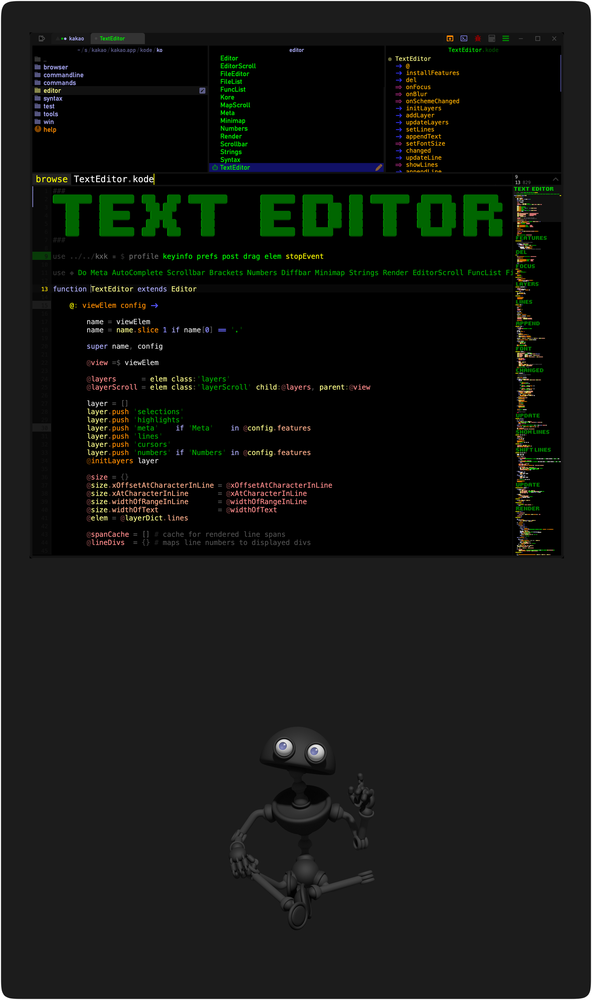

#### How to build the app on a mac

Install build dependencies node and zig via brew, 
clone the repository, build and run the app:

```
/bin/bash -c "$(curl -fsSL https://raw.githubusercontent.com/Homebrew/install/HEAD/install.sh)"
brew install node zig

git clone https://github.com/monsterkodi/ko.git

cd ./ko/ko.app

./kk -bkr
```

